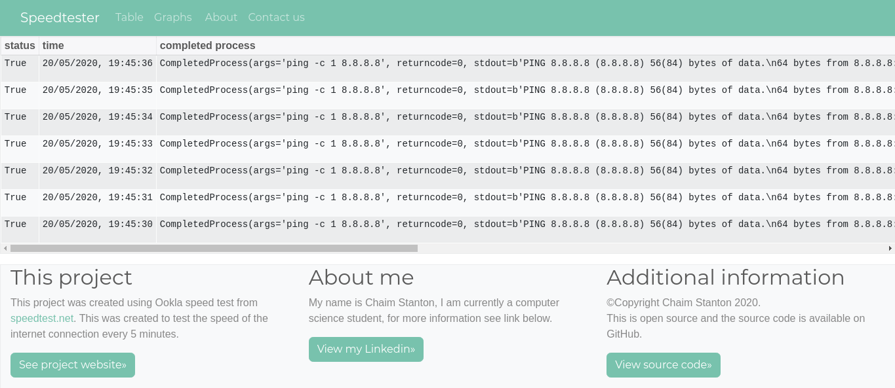

# Speedtest
This is a program that can speed test output into a html file. 
This is designed to be run on a linux server. I have used a Raspberry Pi plugged directly into my router. 
Note that in order to get the most accurate results.



## Example
To see an example of this [click here](http://pingtest.rf.gd/) (Note: this is completely static)

## Usage
### Run the program on linux
* In order to run the python program from the terminal and continue with the terminal type
the line 
```nohup python3 speedtest.py &``` then press enter again   
* (However in order to do this you will need to have nohup installed)
* Then navigate to index.php (via web server)

### Kill the python3 process using linux
* Type `ps -aux` to get the process identification numbers 
* Then put type `kill <process number>`

### Dependencies 
* python3 
* A web server with php installed 
* [speedtest-cli](https://pypi.org/project/speedtest-cli/) you can install it with pip `python3 -m pip install speedtest-cli` (other options are available via the link)  

## Licence
* I will add an update with a licence at some point. (Before then any changes will be owned by me) 

## Misc
naming convention `Major.Minor.Release`  
  
